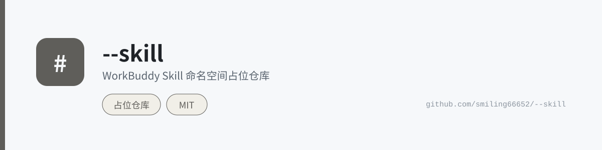

  <picture>
    <source media="(prefers-color-scheme: dark)" srcset="assets/banner-dark.svg">
    
  </picture>

> WorkBuddy Skill 占位仓库

本仓库为 WorkBuddy Skill 体系的命名占位仓库，用于保留 `--skill` 这一关键命名空间。

## 相关项目

- [WorkBuddy Skill Toolkits](https://github.com/smiling66652/workbuddy-skill-toolkits) - Skill 工具箱套件合集
- [Skill Integrator](https://github.com/smiling66652/skill-integrator) - 技能整合器元技能

## License

MIT License - 详见 [LICENSE](LICENSE)
